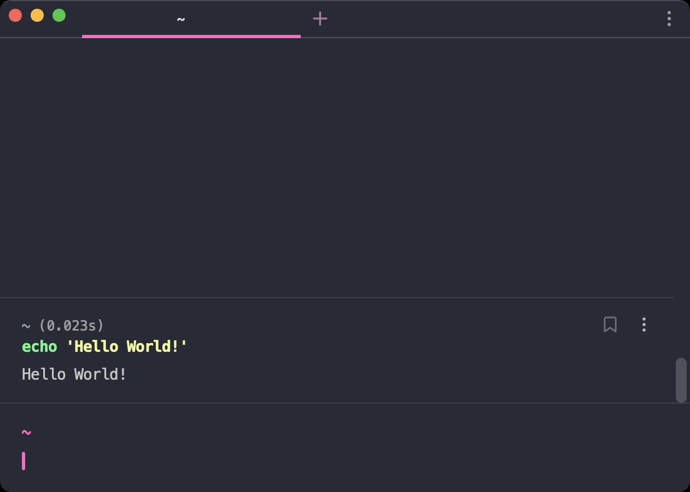

# Warp theme Snazzy

Elegant [Warp](https://warp.dev/) theme with bright colors

## Install

Copy the `Snazzy.yml` into to the `~/.warp/themes`

### Tip

To get the exact same look as in the screenshot, you need to;

- use the [Pure](https://github.com/sindresorhus/pure) prompt,
- Menlo font
- [zsh-syntax-highlighting](https://github.com/zsh-users/zsh-syntax-highlighting) plugin to have commands highlighted.
- Enabled the 'Honer user's custom propmt (PS1) setting' in Warp

## Related

- [hyper-snazzy](https://github.com/sindresorhus/hyper-snazzy)
- [vscode-snazzy](https://github.com/Tyriar/vscode-snazzy)
- [iterm2-snazzy](https://github.com/sindresorhus/iterm2-snazzy)
- [terminal-snazzy](https://github.com/sindresorhus/terminal-snazzy)
- [st-snazzy](https://github.com/Dko1905/st-snazzy)
- [konsole-snazzy](https://github.com/miedzinski/konsole-snazzy)
- [emacs-snazzy](https://github.com/weijiangan/emacs-snazzy)
- [termite-snazzy](https://github.com/kbobrowski/termite-snazzy)
- [deepin-snazzy](https://github.com/xxczaki/deepin-snazzy)
- [kitty-snazzy](https://github.com/connorholyday/kitty-snazzy)
- [vim-snazzy](https://github.com/connorholyday/vim-snazzy)
